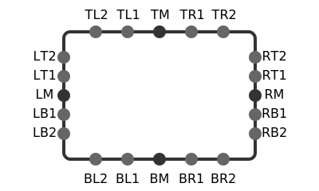

# Processes

A process defines a workflow as a single class where methods are activities. Process files are named `<name>.process.ts` and located in `design/processes/` by default.

## Process Class

```typescript
import { Process } from "@apexdesigner/dsl/process";

export class ProcessOrder extends Process {
}
```

## Properties

Properties hold process state:

```typescript
import { Order, Customer } from "@business-objects";

export class ProcessOrder extends Process {
  order?: Order;
  customer?: Customer;
  isApproved?: boolean;
  trackingNumber?: string;
}
```

## Start Method

The `@start()` decorator marks the programmatic entry point. Parameters define the process inputs:

```typescript
import { start } from "@apexdesigner/dsl/process";

export class ProcessOrder extends Process {
  order?: Order;
  customer?: Customer;
  isApproved?: boolean;

  @start()
  beginOrder(order: Order, customer: Customer) {
    // ...
  }
}
```

## Message Start

The `@messageStart()` decorator marks a message-triggered entry point. The parameter type determines which message starts the process:

```typescript
import { messageStart } from "@apexdesigner/dsl/process";
import { NewOrderMessage } from "@process-messages";

export class ProcessOrder extends Process {
  order?: Order;

  @messageStart()
  onNewOrder(message: NewOrderMessage) {
    this.order = message.order;
    this.validateOrder();
  }
}
```

A process can have multiple entry points:

```typescript
export class ProcessOrder extends Process {
  order?: Order;

  @start()
  beginOrder(order: Order, customer: Customer) {
    this.order = order;
    this.validateOrder();
  }

  @messageStart()
  onNewOrder(message: NewOrderMessage) {
    this.order = message.order;
    this.validateOrder();
  }

  @messageStart()
  onBulkOrder(message: BulkOrderMessage) {
    this.orders = message.orders;
    this.processBulk();
  }
}
```

## Activities and Flows

Activities are methods on the process class. Call a method to flow to that activity.

```typescript
export class ProcessOrder extends Process {
  // ...

  @start()
  async beginOrder() {
    this.submitOrder();
  }

  submitOrder() {
    // ...
    this.reviewOrder();
  }

  reviewOrder() {
    // ...
    this.end();
  }

  @end()
  end() {}
}
```

## User Task

A user task waits for human input. The `.then()` chains the next activity.

```typescript
export class ProcessOrder extends Process {
  // ...

  reviewOrder() {
    createUserTask()
      .then(() => this.end());
  }

  end() {}
}
```

### Task Assignment

Assign the task to a static role:

```typescript
import { SalesManager } from "@roles";

export class ProcessOrder extends Process {
  // ...

  reviewOrder() {
    createUserTask({ role: SalesManager })
      .then(() => this.end());
  }
}
```

Assign the task to a dynamic role:

```typescript
export class ProcessOrder extends Process {
  // ...

  reviewOrder() {
    createUserTask({ role: () => this.order.region + ' Manager' })
      .then(() => this.end());
  }
}
```

Or fetch the role before creating the task:

```typescript
import { getApproverRole } from "@utilities/roles";

export class ProcessOrder extends Process {
  // ...

  async reviewOrder() {
    const approverRole = await getApproverRole(this.order.amount);

    createUserTask({ role: approverRole })
      .then(() => this.end());
  }
}
```

Or assign to a specific user:

```typescript
export class ProcessOrder extends Process {
  // ...

  reviewOrder() {
    createUserTask({
      user: async () => {
        const manager = await orgService.getManagerFor(this.order.department);
        return manager.email;
      },
    })
      .then(() => this.end());
  }
}
```

### User Task Component

A user task can specify a [component](components.md) to display. Import the component and chain it with `.component()`. Inputs and outputs are type-checked:

```typescript
import { ReviewOrderForm } from "@process-components";

export class ProcessOrder extends Process {
  // ...

  reviewOrder() {
    createUserTask({ role: SalesManager })
      .component(ReviewOrderForm({ order: this.order, customer: this.customer }))
      .then((outputs) => {
        // outputs: { notes: string; decision: 'approved' | 'rejected' }
        this.order.notes = outputs.notes;
        this.order.decision = outputs.decision;

        this.processDecision();
      });
  }
}
```

Types for components are generated from the component DSL into `@process-components`. Each component becomes a function — inputs are parameters, outputs are carried as a phantom type for inference:

```typescript
// design/@types/process-components/review-order-form.d.ts

export declare function ReviewOrderForm(inputs: {
  order: Order;
  customer: Customer;
}): TaskDefinition<{ notes: string; decision: 'approved' | 'rejected' }>;
```

### User Task with Agent

A user task can use `.agent()` instead of `.component()` to pair the assigned user with an [agent](agents.md). The agent drives a conversation with the user and collects the structured outputs:

```typescript
import { ProcurementReviewAgent } from "@agents";
import { SalesManager } from "@roles";

export class ProcessOrder extends Process {
  // ...

  reviewOrder() {
    createUserTask({ role: SalesManager })
      .agent(ProcurementReviewAgent({
        order: this.order,
        customer: this.customer,
      }))
      .then((outputs) => {
        this.order.decision = outputs.decision;
        this.order.notes = outputs.notes;
        this.processDecision();
      });
  }
}
```

Task assignment (`role`, `user`) and boundary events work the same as any other user task. See [agents](agents.md) for how to define agents.

## Service Task

Service tasks are [app behaviors](app-behaviors.md) with type "Service Task". They run asynchronously and are managed by the process engine:

```typescript
import { sendConfirmationEmail } from "@app-behaviors";

export class ProcessOrder extends Process {
  // ...

  sendConfirmation() {
    createServiceTask(sendConfirmationEmail({ order: this.order, customer: this.customer }))
      .then((outputs) => {
        // outputs: { trackingNumber: string }
        this.trackingNumber = outputs.trackingNumber;
        this.approvedEnd();
      });
  }
}
```

Service tasks can have boundary events:

```typescript
createServiceTask(sendConfirmationEmail({ order: this.order, customer: this.customer }))
  .then((outputs) => {
    this.trackingNumber = outputs.trackingNumber;
    this.approvedEnd();
  })
  .boundaryEvents({
    timeout: timer({ duration: 'PT1H' }).then(this.escalate),
  });
```

## Script Task

For inline logic without a queue, use a regular method:

```typescript
export class ProcessOrder extends Process {
  // ...

  calculateShipping() {
    const weight = this.order.items.reduce((sum, item) => sum + item.weight, 0);

    this.order.shippingCost = weight * 0.5;

    if (this.order.total > 100) {
      this.order.shippingCost = 0;
    }

    this.packOrder();
  }
}
```

## Decision Task

Call a [decision table](decision-tables.md) to evaluate business rules:

```typescript
import { TaxBracket } from "@decision-tables";

export class ProcessOrder extends Process {
  // ...

  calculateTax() {
    const result = TaxBracket.evaluate(this.order.income);
    this.order.taxRate = result.rate;

    this.applyTax();
  }
}
```

## Data Flow Task

A data flow task runs a [data flow](data-flows.md) as a process activity. It has the same mechanics as a service task but is visually distinct in the process diagram:

```typescript
import { PrepareInvoice } from "@data-flows";

export class ProcessOrder extends Process {
  // ...

  prepareInvoice() {
    createDataFlowTask(PrepareInvoice({ orderId: this.order.id }))
      .then((invoice) => {
        this.order.invoice = invoice;
        this.shipOrder();
      });
  }
}
```

## Agent Task

An agent task runs an [agent](agents.md) autonomously without human interaction. The agent processes the inputs, optionally calls tools, and produces typed outputs:

```typescript
import { ProcurementReviewAgent } from "@agents";

export class ProcessOrder extends Process {
  // ...

  classifyOrder() {
    createAgentTask(ProcurementReviewAgent({
      order: this.order,
      customer: this.customer,
    }))
      .then((outputs) => {
        // outputs: { decision: 'approved' | 'rejected' | 'needs_escalation'; notes: string; suggestedDiscount?: number }
        this.order.decision = outputs.decision;
        this.order.notes = outputs.notes;
        this.processDecision();
      });
  }
}
```

Agent tasks can have boundary events:

```typescript
createAgentTask(ProcurementReviewAgent({
  order: this.order,
  customer: this.customer,
}))
  .then((outputs) => {
    this.order.decision = outputs.decision;
    this.processDecision();
  })
  .boundaryEvents({
    timeout: timer({ duration: 'PT5M' }).then(this.escalate),
  });
```

## Gateways

Gateways control branching and require decorators for the engine.

### Exclusive Gateway

One path is taken based on conditions:

```typescript
export class ProcessOrder extends Process {
  // ...

  @exclusiveGateway()
  validateOrder() {
    if (this.order.total > 10000) {
      this.requireManagerApproval();
    } else if (this.order.isValid) {
      this.sendConfirmation();
    } else {
      this.sendRejection();
    }
  }
}
```

### Parallel Gateway (fork)

All paths are taken simultaneously:

```typescript
export class EmployeeOnboarding extends Process {
  // ...

  @parallelGateway()
  fork() {
    this.prepareBenefits();
    this.setupWorkstation();
    this.createAccounts();
  }
}
```

### Parallel Gateway (join)

When multiple paths call the same method, mark it with `@parallelGateway()`. The engine waits for all active tokens:

```typescript
export class EmployeeOnboarding extends Process {
  // ...

  prepareBenefits() {
    createServiceTask(setupBenefits({ employee: this.employee }))
      .then(() => this.postSetup());
  }

  setupWorkstation() {
    createServiceTask(provisionWorkstation({ employee: this.employee }))
      .then(() => this.postSetup());
  }

  createAccounts() {
    createServiceTask(createUserAccounts({ employee: this.employee }))
      .then(() => this.postSetup());
  }

  @parallelGateway()
  postSetup() {
    // Engine waits for all 3 branches before executing
    this.scheduleMeetings();
  }
}
```

### Inclusive Gateway

One or more paths are taken based on conditions:

```typescript
export class ProcessOrder extends Process {
  // ...

  @inclusiveGateway()
  notificationRouting() {
    this.updateInventory();

    if (this.order.total > 1000) {
      this.notifyManager();
    }

    if (this.customer.prefersSMS) {
      this.sendSms();
    }
  }
}
```

## Boundary Events

Boundary events handle interruptions on an activity. Chain them with `.boundaryEvents({...})`.

### Timer Events

A timer boundary event triggers after a duration. By default, it interrupts (stops) the activity:

```typescript
.boundaryEvents({
  timeout: timer({ duration: 'PT24H' }).then(this.escalation),
})
```

Non-interrupting timers let the activity continue:

```typescript
.boundaryEvents({
  warning: timer({ duration: 'PT12H', nonInterrupting: true }).then(this.sendWarning),
})
```

Repeating timers fire multiple times (implies non-interrupting):

```typescript
.boundaryEvents({
  reminder: timer({ duration: 'PT1H', repeating: true }).then(this.sendReminder),
})
```

Limit the number of repetitions with `max`:

```typescript
.boundaryEvents({
  reminder: timer({ duration: 'PT1H', repeating: true, max: 3 }).then(this.sendReminder),
})
```

Duration uses ISO 8601 format: `PT24H` (24 hours), `P7D` (7 days), `PT30M` (30 minutes).

### Message Events

Use message types from `@process-messages` in boundary events:

```typescript
import { OrderCancellationMessage, PriorityUpdateMessage } from "@process-messages";

// ...

.boundaryEvents({
  cancellation: OrderCancellationMessage().then(this.handleCancellation),
  priorityChange: PriorityUpdateMessage().then((payload) => {
    this.order.priority = payload.newPriority;
    this.reassign();
  }),
})
```

Messages are defined in `design/messages/` and generated into `@process-messages`:

```typescript
// design/messages/order-cancellation.message.ts
export class OrderCancellationMessage extends Message {
  orderId?: string;
  reason?: string;
}
```

### Conditional Events

Trigger when a condition becomes true:

```typescript
.boundaryEvents({
  paymentReceived: condition(() => this.order.paymentStatus === 'completed').then(this.shipOrder),
})
```

### Complete Example

```typescript
export class ProcessOrder extends Process {
  // ...

  reviewOrder() {
    createUserTask({ role: SalesManager })
      .component(ReviewOrderForm({ order: this.order }))
      .then((outputs) => {
        this.order.notes = outputs.notes;
        this.order.decision = outputs.decision;

        this.processDecision();
      })
      .boundaryEvents({
        timeout: timer({ duration: 'PT24H' }).then(this.escalation),
        reminder: timer({ duration: 'PT1H', repeating: true, max: 3 }).then(this.sendReminder),
      });
  }
}
```

## Call Activity

Invoke a sub-process. Import from `@processes`:

```typescript
import { InvestigationProcess } from "@processes";

export class SupportTicket extends Process {
  // ...

  investigate() {
    InvestigationProcess.start()
      .then(() => this.resolved());
  }
}
```

### Inputs and Outputs

A sub-process defines inputs on `@start()` and outputs on `@end()`:

```typescript
export class InvestigationProcess extends Process {
  ticket?: Ticket;
  priority?: Priority;
  resolution?: string;

  @start()
  beginInvestigation(ticket: Ticket, priority: Priority) {
    this.ticket = ticket;
    this.priority = priority;
    this.assignInvestigator();
  }

  // ... activities ...

  @end()
  resolved() {
    return { resolution: this.resolution };
  }
}
```

The caller passes inputs and receives outputs with full type checking:

```typescript
import { InvestigationProcess } from "@processes";

export class SupportTicket extends Process {
  // ...

  investigate() {
    InvestigationProcess.start(this.ticket, this.ticket.severity)
      .then((result) => {
        // result: { resolution: string }
        this.resolution = result.resolution;
        this.resolved();
      });
  }
}
```

### Multiple Ends

A process can have multiple `@end()` methods. The output type is the union of all return types:

```typescript
export class InvestigationProcess extends Process {
  // ...

  @end()
  resolved() {
    return { status: 'resolved', resolution: this.resolution };
  }

  @end()
  unresolved() {
    return { status: 'unresolved', reason: this.reason };
  }
}
```

The caller handles the union:

```typescript
import { InvestigationProcess } from "@processes";

export class SupportTicket extends Process {
  // ...

  investigate() {
    InvestigationProcess.start(this.ticket, this.ticket.severity)
      .then((result) => {
        if (result.status === 'resolved') {
          this.resolution = result.resolution;
          this.resolved();
        } else {
          this.escalateUnresolved();
        }
      });
  }
}
```

### Boundary Events

Call activities can have boundary events:

```typescript
import { InvestigationProcess } from "@processes";

export class SupportTicket extends Process {
  // ...

  investigate() {
    InvestigationProcess.start(this.ticket, this.ticket.severity)
      .then((result) => {
        this.resolution = result.resolution;
        this.resolved();
      })
      .boundaryEvents({
        timeout: timer({ duration: 'P7D' }).then(this.escalate),
      });
  }
}
```

## Multi-Instance

Run an activity for each item in a collection.

### Parallel

All instances run simultaneously:

```typescript
import { parallel } from "@apexdesigner/dsl/process";

export class ProcessOrder extends Process {
  // ...

  reviewItems() {
    parallel(this.order.items, (item, index) => {
      createUserTask({ role: Reviewer })
        .component(ReviewForm({ item, index }))
        .then((result) => {
          item.approved = result.approved;
        });
    }).then(() => this.finalizeReviews());
  }
}
```

### Sequential

Instances run one at a time:

```typescript
import { sequential } from "@apexdesigner/dsl/process";

export class ProcessOrder extends Process {
  // ...

  reviewItems() {
    sequential(this.order.items, (item, index) => {
      createUserTask({ role: Reviewer })
        .component(ReviewForm({ item, index }))
        .then((result) => {
          item.approved = result.approved;
        });
    }).then(() => this.finalizeReviews());
  }
}
```

### Early Completion

Use `.completeWhen()` to finish before all instances complete:

```typescript
import { parallel } from "@apexdesigner/dsl/process";

export class ApprovalProcess extends Process {
  // ...

  requestApprovals() {
    parallel(this.approvers, (approver, index) => {
      createUserTask({ role: approver.role })
        .component(ApprovalForm({ request: this.request, index }))
        .then((result) => {
          return { approved: result.approved };
        });
    })
    .completeWhen((results) => results.filter(r => r.approved).length >= 2)
    .then(() => this.finalize());
  }
}
```

### Boundary Events

Multi-instance activities can have boundary events:

```typescript
import { parallel } from "@apexdesigner/dsl/process";

export class ProcessOrder extends Process {
  // ...

  reviewItems() {
    parallel(this.order.items, (item, index) => {
      createUserTask({ role: Reviewer })
        .component(ReviewForm({ item, index }));
    })
    .then(() => this.finalizeReviews())
    .boundaryEvents({
      timeout: timer({ duration: 'PT1H' }).then(this.escalate),
    });
  }
}
```

## Roles

Control who can start a new process instance:

```typescript
import { roles } from "@apexdesigner/dsl/process";
import { SalesRep, SalesManager } from "@roles";

@roles({ start: [SalesRep, SalesManager] })
export class ProcessOrder extends Process {
  // ...
}
```

Control who can view process instances:

```typescript
import { roles } from "@apexdesigner/dsl/process";
import { SalesRep, SalesManager, Administrator } from "@roles";

@roles({ view: [SalesRep, SalesManager, Administrator] })
export class ProcessOrder extends Process {
  // ...
}
```

Control who can manage (cancel, reassign) process instances:

```typescript
import { roles } from "@apexdesigner/dsl/process";
import { SalesManager, Administrator } from "@roles";

@roles({ manage: [SalesManager, Administrator] })
export class ProcessOrder extends Process {
  // ...
}
```

## Process Layout

Use `applyLayout()` after the class to define the visual diagram using spreadsheet-style coordinates.

### Activity Cells

Place activities on a grid using `R1,C1` coordinates (row, column):

```typescript
import { applyLayout } from "@apexdesigner/dsl/process";

export class ProcessOrder extends Process {
  // ...
}

applyLayout(ProcessOrder, {
  activityCells: {
    beginOrder: 'R1,C1',
    reviewOrder: 'R1,C2',
    end: 'R1,C3',
  },
});
```

### Swimlane Rows

Group rows under labeled swimlanes:

```typescript
import { applyLayout } from "@apexdesigner/dsl/process";

export class ProcessOrder extends Process {
  // ...
}

applyLayout(ProcessOrder, {
  swimlaneRows: {
    'Customer': 'R1',
    'Sales Team': 'R2:R3',
  },
  activityCells: {
    submitOrder: 'R1,C1',
    reviewOrder: 'R2,C2',
    escalate: 'R3,C2',
  },
});
```

Single row `'R1'` or range `'R2:R3'`.

### Boundary Events

Activities with boundary events expand to an object:

```typescript
applyLayout(ProcessOrder, {
  activityCells: {
    reviewOrder: {
      cell: 'R2,C3',
      boundaryEvents: {
        timeout: 'BL1',
        reminder: 'BR1',
      },
    },
  },
});
```

Boundary event positions attach to the activity edge:

- Center: `TM`, `BM`, `LM`, `RM`
- One step from center: `TL1`, `TR1`, `BL1`, `BR1`, `LT1`, `LB1`, `RT1`, `RB1`
- Near corner: `TL2`, `TR2`, `BL2`, `BR2`, `LT2`, `LB2`, `RT2`, `RB2`



### Flow Routing

Default flow is `RM -> LM` (right middle to left middle). Only specify flows that need labels or custom routing:

For non-default routes, use the `route` property with gutters:

```typescript
flowRouting: {
  'validateOrder -> sendRejection': { route: 'BM -> R3 -> LM' },
  'approvedEnd -> beginOrder': { route: 'TM -> R1 -> TM' },
},
```

Route format: `from -> [gutters...] -> to`

- **Edge positions**: `TM` (top middle), `BM` (bottom middle), `LM` (left middle), `RM` (right middle)
- **Gutters**: `R1`, `R2` (row gutters), `C1`, `C2` (column gutters)

Boundary event flows use dot notation. The `from` position is already defined in `boundaryEvents`, so only specify routing if the flow needs gutters:

```typescript
flowRouting: {
  'reviewOrder.timeout -> escalation': {},
  'reviewOrder.reminder -> notify': { route: 'BR1 -> R3 -> LM' },
},
```

Flow labels:

```typescript
flowRouting: {
  'validateOrder -> sendConfirmation': { label: 'Approved' },
  'validateOrder -> sendRejection': { route: 'BM -> R3 -> LM', label: 'Rejected' },
},
```

Adjust label position with offset:

```typescript
flowRouting: {
  'validateOrder -> sendRejection': { route: 'BM -> R3 -> LM', label: { text: 'Rejected', dx: 10, dy: -5 } },
},
```

### Complete Example

```typescript
import { Process, applyLayout } from "@apexdesigner/dsl/process";

export class ProcessOrder extends Process {
  // ...
}

applyLayout(ProcessOrder, {
  swimlaneRows: {
    'Customer Service': 'R1',
    'Sales Team': 'R2:R3',
    'Shipping Dept': 'R4',
  },
  activityCells: {
    beginOrder: 'R1,C1',
    submitOrder: 'R1,C2',
    reviewOrder: {
      cell: 'R2,C3',
      boundaryEvents: {
        timeout: 'BL1',
        reminder: 'BR1',
      },
    },
    validateOrder: 'R2,C4',
    sendConfirmation: 'R2,C5',
    sendRejection: 'R3,C5',
    approvedEnd: 'R2,C7',
    rejectedEnd: 'R3,C7',
    shipOrder: 'R4,C6',
  },
  flowRouting: {
    'validateOrder -> sendConfirmation': { label: 'Approved' },
    'validateOrder -> sendRejection': { route: 'BM -> R3 -> LM', label: 'Rejected' },
    'reviewOrder.timeout -> escalation': { label: 'Timeout' },
  },
});
```
